# Installation and Setup Guide

## Pre-requisites

- [Install Visual Studio Code](https://code.visualstudio.com/Download)
- [Install PlatformIO as an extension for VSCode](https://platformio.org/install/ide?install=vscode)

## Installation

To install CL-FW, go to the [Releases Page](https://github.com/Crane1195/CL-FW/releases) of this repository.

Under the latest one, click **Assets**, then click **Source Code (zip)**.

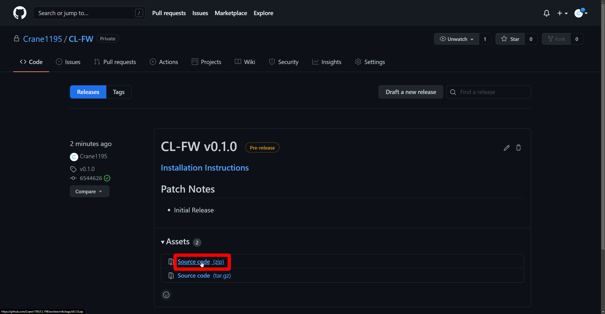

---

Copy the folder within the ZIP file to somewhere convenient for you, such as the Desktop.

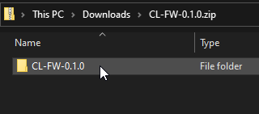

---

Open PlatformIO within VSCode.

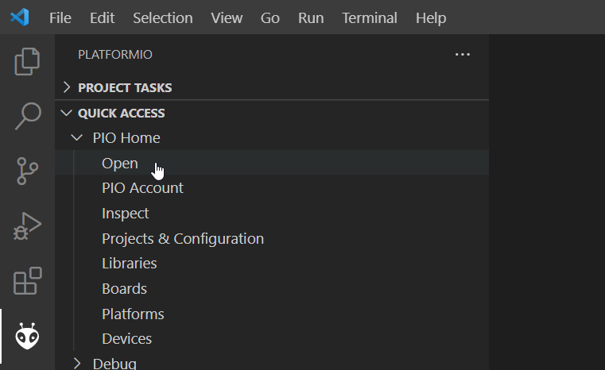

---

Select **Open Project**.

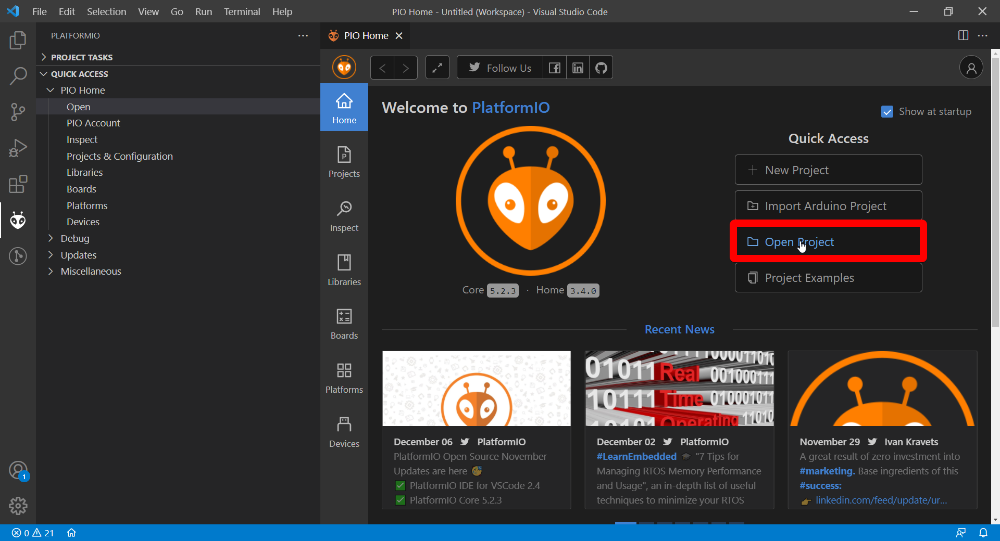

---

Navigate to the folder you copied out of the ZIP file and select **Open "CL-FW-X.Y.Z"**.

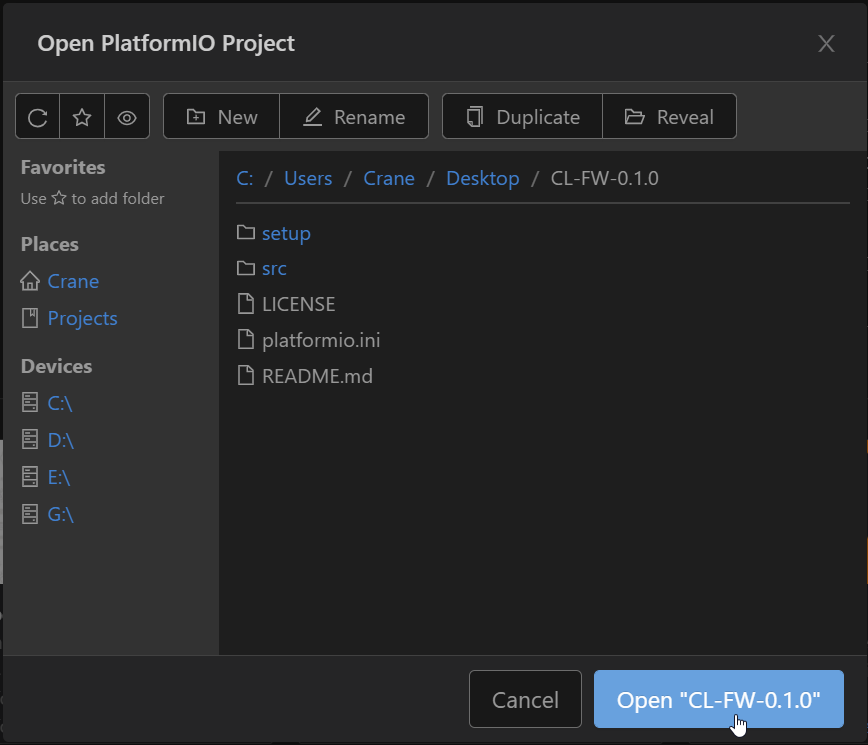

---

On the bottom bar, click this button to change the platform you are using.

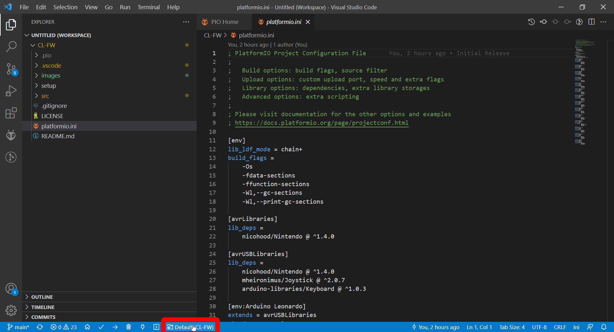

---

Scroll through this menu and select the device you are using.

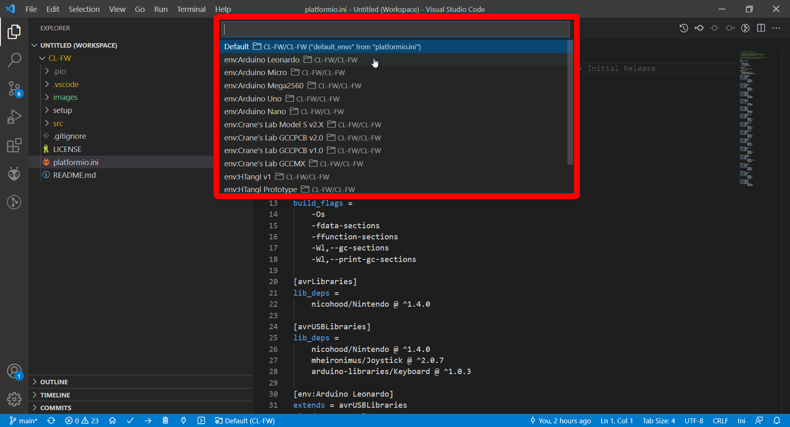

---

If you wish to change your pinout, navigate to `CL-FW/src/Hardware` on the Explorer tab, and double click the file that corresponds to your device.
- ArduinoDIY.h is used for the Arduino Leonardo, Micro, Pro Micro, Nano, Uno, and Mega2560.
- If you use a GCCMX, HTangl, B0XX, or HitBox Smash Box, the pinouts in these files match up with the controllers default pinout.
- If you are using a Model S or GCCPCB, the pinouts in these files match up with the button mapping shown in their User's Manuals.
- 255 Indicates that the button is not present on the controller

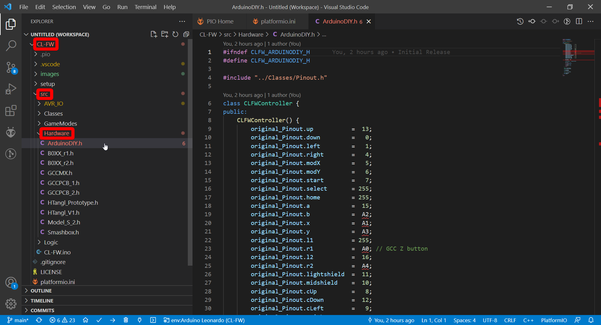

---

If you wish to change the button mapping for a specific game, navigate to `CL-FW/src/GameModes`.

In the constructor function, you will see a section where you can redefine which button corresponds to which of the original buttons.

See the `FGC.h` file for an example of how this is used.

---

You can configure SOCD for each Game in `src/CL-FW.ino`, which button hold corresponds to which mode in `src/Classes/Modes.h`, which coordinates each game uses in their respective files, and quite a bit more if you are willing to read through the code a bit.

---

Once you are finished configuring your firmware, press the right facing arrow on the bottom bar to upload the firmware to your controller.

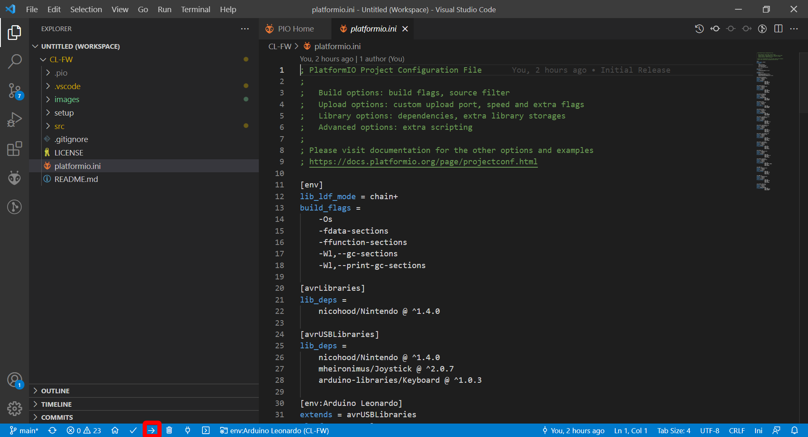

---

## Game Profiles
Currently there are 5 game profiles. Melee, Ultimate, PM, RoA, and FGC/D-pad. While plugging in the controller:
* Hold no buttons for Melee.
* Hold B for Ultimate.
* Hold X for PM.
* Hold Z for RoA.
* Hold Up for FGC/D-pad.

## Device Modes
Currently there are 4 device modes. GameCube, N64, PC Dinput Gamepad, and PC Keyboard. While plugging in the controller:
* Hold no buttons for GameCube Mode
* Hold C-Up for N64 Mode
* Plug in via USB and hold no buttons for PC Dinput Gamepad Mode
* Plug in via USB and hold modY for PC Keyboard Mode

## Input Viewer Setup
CL-FW is compatible with [OtaK's B0XX Viewer RS](https://github.com/OtaK/b0xx-viewer-rs). See the README there for instructions on how to set it up.

## Dolphin Setup
In the folder you copied out of the ZIP file, navigate to `setup` and copy the `CL-FW.ini` file into this Dolphin folder.
- If this folder path does not exist, create the necessary folders.

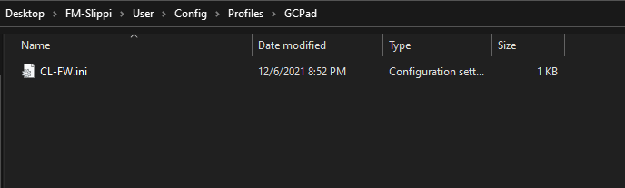

In Dolphin, click **Controllers**, then set Port 1 to **Standard Controller**, then click **Configure** next to Port 1.

Open the Profile drop down, select **CL-FW**, and click **Load**.

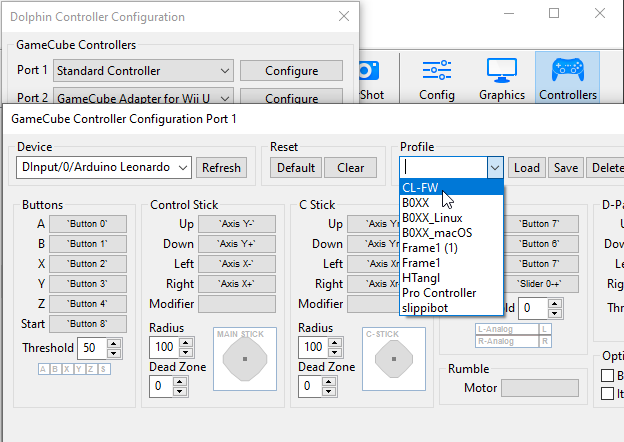

---

## Installation using Platformio CLI (no VSCode requirement)

If you don't have VSCode installed, you can also install the firmware using Platformio's CLI tool.

- [Install the Platformio CLI tool](https://platformio.org/install/cli) There are distributions for most Linux distros and it is also available on PyPi (pip install -U platformio).

- Clone the CL-FW repository to a folder on your system:
```
  git clone https://github.com/Crane1195/CL-FW.git
```

- Navigate to the CL-FW directory with `cd CL-FW`

- Find the name of your device in platformio.ini. For example, if you're installing onto an Arduino Nano, note the exact name of the device from this line:
```
  [env:Arduino Nano]
```

- Install the firmware onto your device using the Platformio CLI's "pio" command and the device name from the INI file.

For example, to load the firmware onto an Arduino Nano:
```
$ pio run --target upload -e 'Arduino Nano'
```

---

## Contact
Let me know if you have any issues with the firmware in my Discord Server:
https://craneslab.xyz/discord

## Support my work
I set up a donation link for people who appreciate my work and wish to donate. Donations are greatly appreciated, but are far from necessary:

https://www.paypal.com/donate/?hosted_button_id=NFDEML5FKR8N8
